# Instalación del servico Odoo, PgAdmin y respaldo de base de datos de Odoo.

Realizamos los pasos de instalación y puesta en marcha vistos en prácticas anteriores.

 <br><br>
  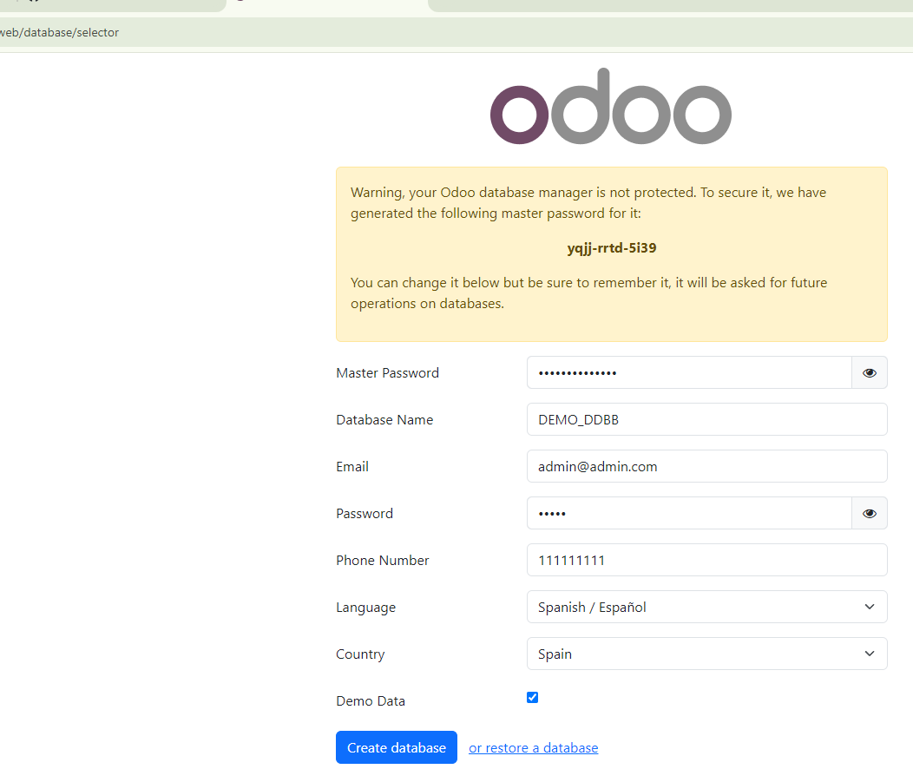

 <br><br>
  

 <br><br>
  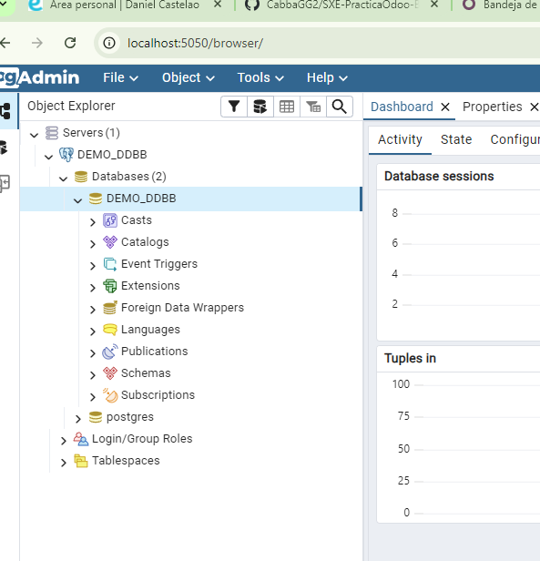

## Realización de los apartados:

<details><summary><h3>Apartado 1</h3></summary>
  
  - Hacemos click derecho en las tablas ➡ Create ➡ Table.. 
  <br><br>
  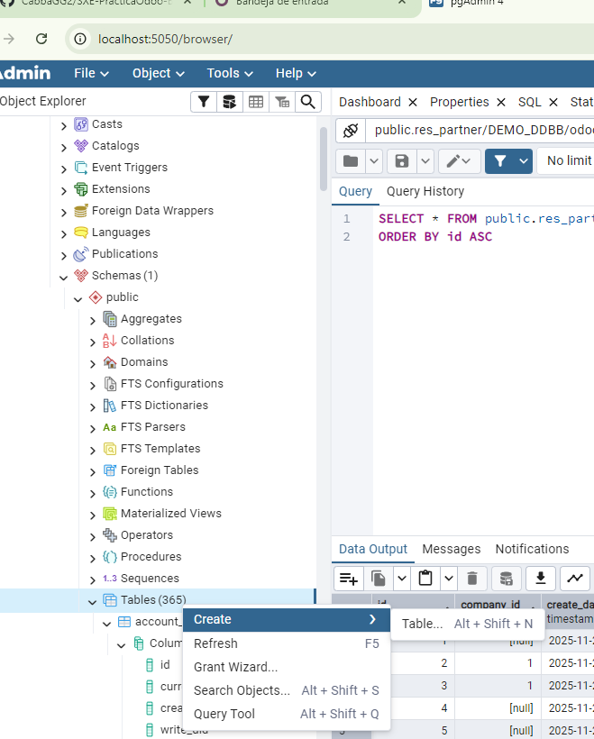
  <br><br>
  - Nombramos la tabla en el espacio "Name" como "EmpresasFCT"
  <br><br>
  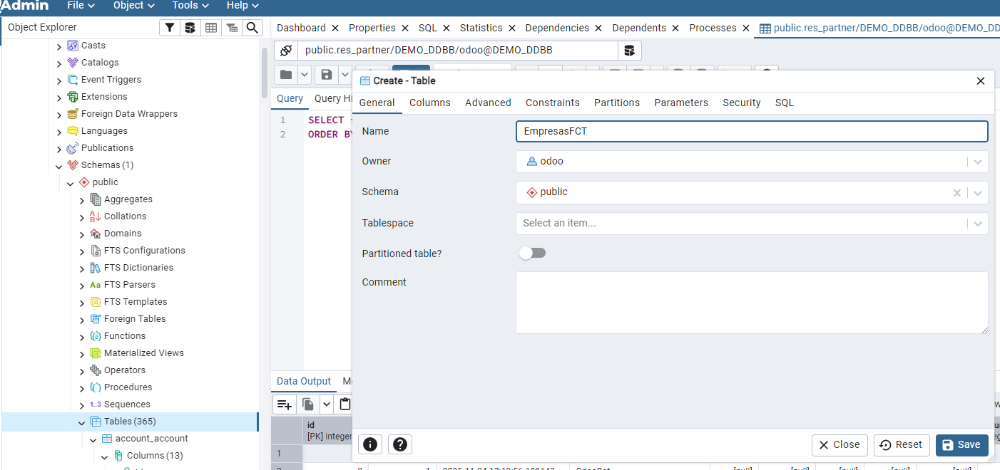
  - Vamos agregando las tablas de una en una con su nombre y los parametros solicitados para ellas y pinchamos "Save".
  <br><br>
  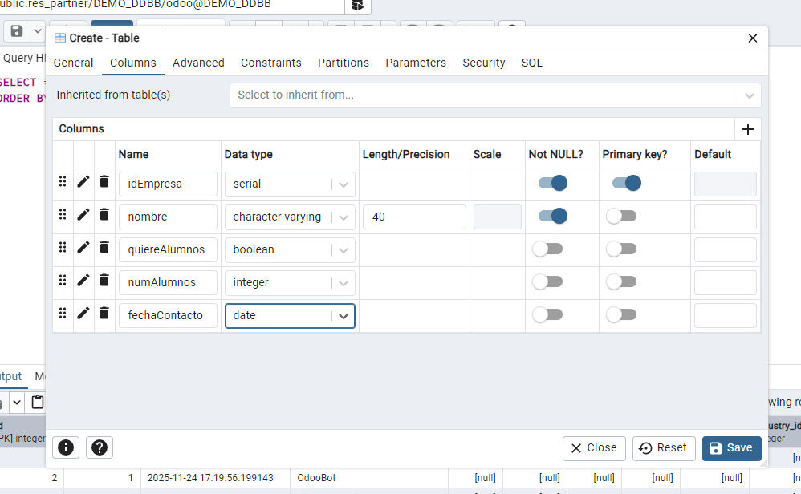
  - En la pestaña "SQL" podemos ver como se genera la sentencia SQL para insertar la tabla con sus respectivas columnas.
  <br><br>
  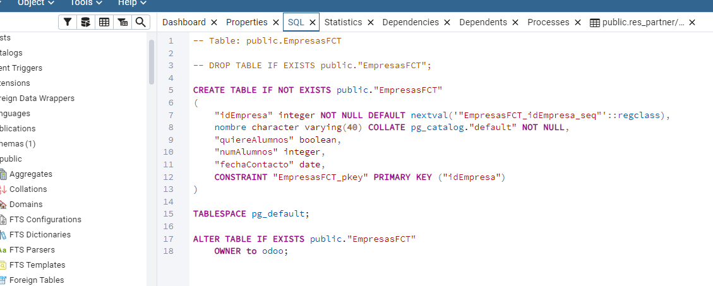
  <br><br>
  - Sentencia SQL:
     ```bash
    CREATE TABLE IF NOT EXISTS public."EmpresasFCT"
    (
    "idEmpresa" integer NOT NULL DEFAULT nextval('"EmpresasFCT_idEmpresa_seq"'::regclass),
    nombre character varying(40) COLLATE pg_catalog."default" NOT NULL,
    "quiereAlumnos" boolean,
    "numAlumnos" integer,
    "fechaContacto" date,
    CONSTRAINT "EmpresasFCT_pkey" PRIMARY KEY ("idEmpresa")
    )
    ```
  
</details>
<details><summary><h3>Apartado 2</h3></summary>
  
  - Hacemos click derecho en la tabla "EmpresasFCT" ➡ Scripts ➡ INSERT Script.
  <br><br>
  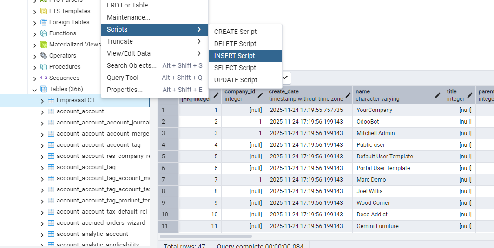
  <br><br>
  - Nos saldrá una pestaña nueva con una sentencia SQL para insertar de base.
  <br><br>
  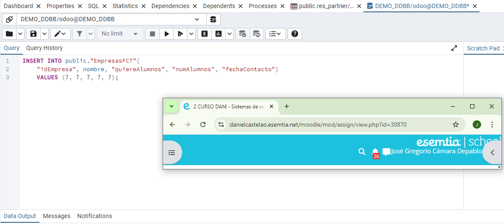
  - Modificamos la sentencia para insertar 5 filas de datos.
  <br><br>
  
  <br><br>
  - Sentencia SQL:
     ```bash
    INSERT INTO public."EmpresasFCT"(
	nombre, "quiereAlumnos", "numAlumnos", "fechaContacto")
	    VALUES ('NovaByte Solutions', TRUE, 3, '2021-12-15'),
		('TechWave Dynamics', FALSE, 0, '2022-12-12'),												
		('AetherSoft Labs', FALSE, 1, '2010-05-30'),
		('BlueCircuit Innovations', TRUE, 4, '2015-02-15'),
		('QuantumEdge Systems', TRUE, 15, '2015-01-04');
    ```
  
</details>
<details><summary><h3>Apartado 3</h3></summary>
  
  - Realizámos una consulta sencilla en una pestaña de SQL en la que ordenamos los datos de manera descendiente utilizando la instrucción ORDER BY.
  <br><br>
  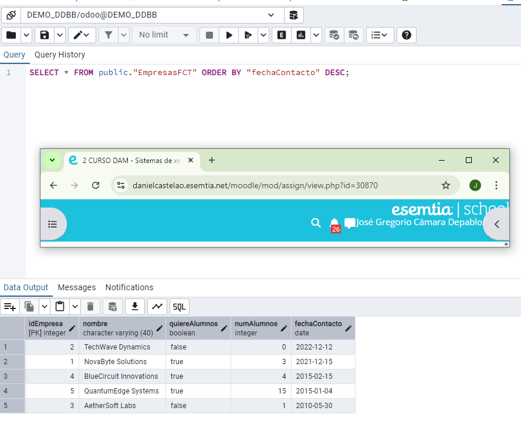
  <br><br>
  - Sentencia SQL:
     ```bash
    SELECT * FROM public."EmpresasFCT" ORDER BY "fechaContacto" DESC;
    ```
</details>
<details><summary><h3>Apartado 4</h3></summary>
  
  - Realiza una consulta que permita obtener un listado de todos los contactos de Odoo (no empresas) con la siguiente información:
    - Nombre
    - Cuya ciudad NO sea Tracy, y código postal 95304
    - Nombre comercial de la empresa
    - ordenados alfabéticamente por el nombre comercial de la empresa,
      <br><br>
      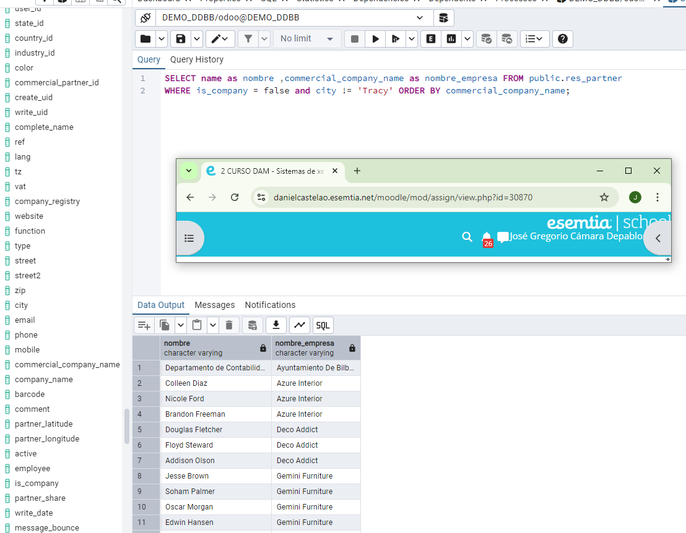
      <br><br>
    - Sentencia SQL:
       ```bash
      SELECT name as nombre ,commercial_company_name as nombre_empresa FROM public.res_partner
        WHERE is_company = false and city != 'Tracy' ORDER BY commercial_company_name;
      ```
</details>
<details><summary><h3>Apartado 5</h3></summary>
  
  - Utilizando las tablas de odoo, obtén un listado de empresas proveedoras, que han emitido algún reembolso (facturas rectificativas de proveedor)
    - Nombre de la empresa
    - Número de factura
    - Fecha de la factura 
    - Total factura SIN impuestos
    - Ordenadas por fecha de factura de modo que la primera sea la más reciente.
  <br><br>
    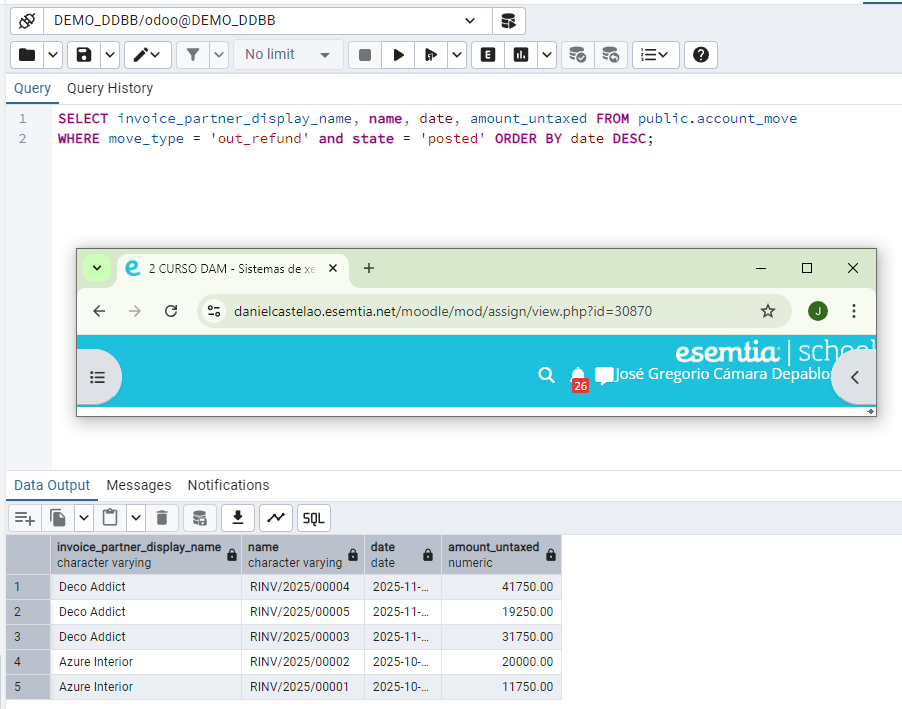
    <br><br>
  -  Para realizar esta consulta nos aseguramos que las facturas eran rectificativas con el campo "move_type" y con "state" verificamos que no sean un borrador. 
    <br><br>
  - Sentencia SQL:
     ```bash
    SELECT invoice_partner_display_name, name, date, amount_untaxed FROM public.account_move
      WHERE move_type = 'out_refund' and state = 'posted' ORDER BY date DESC;
    ```
</details>